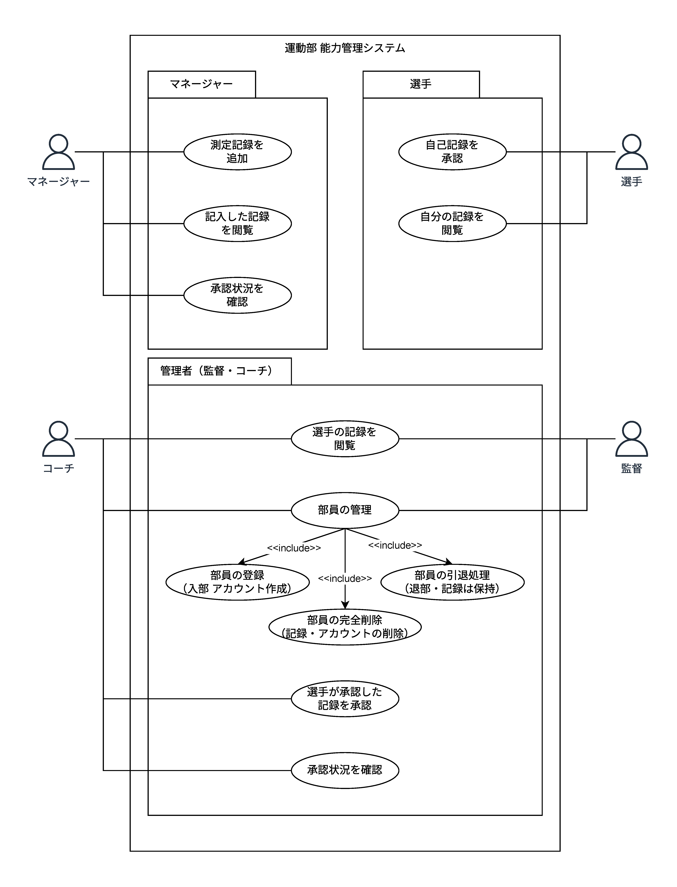
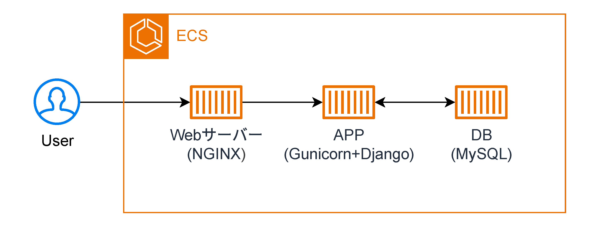
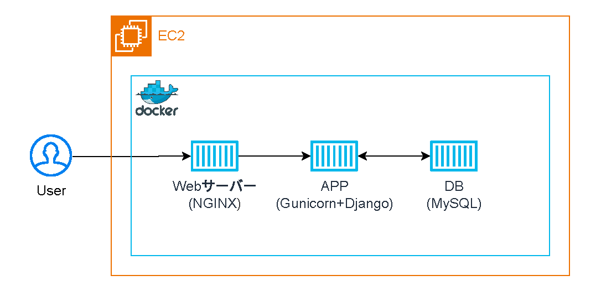
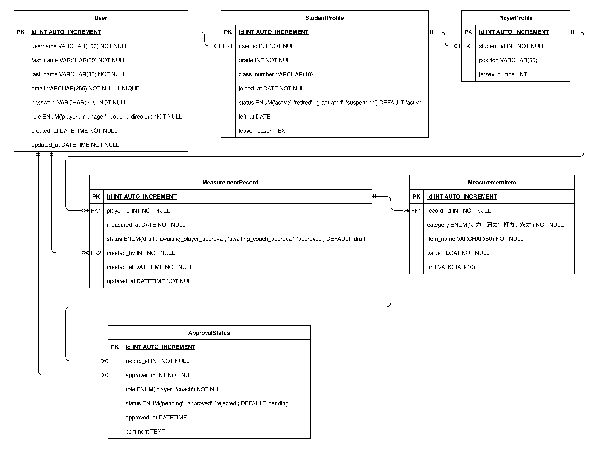

# Talent Manager 運動部 部員身体能力 記録管理サービス
運動部における日々の能力測定の記録を保存し、時系列で確認できます。

## 機能一覧

- 監督・コーチ 共通
    - 部員の管理（入部によるアカウント作成、退部）
    - 全部員の記録を確認
- コーチ
    - プレーヤー(選手)承認済みの測定記録結果を承認
- マネージャー
    - 測定結果の入力
    - 入力した測定結果の承認要求を発行
- プレーヤー
    - 登録された自己の測定記録結果を承認
    - 自己の記録のみが時系列で確認

### ユースケース図

documents/use_case_diagram/他形式ファイル/ユースケース図.png

## システム構成
- 言語: Python
- フレームワーク: Django
- データベース: MySQL
- フロントエンド: Bootstrap javascript
- コンテナ: Docker
- コンテナオーケストレーション: AWS ECS
- インフラ: AWS EC2
- webサーバー: Nginx Gunicorn

### システム構成図
Dockerの上にサービスを稼働させる。コンテナで動くデータベースは別のコンテナの中のAPP(Django)からのみアクセスできる。
- ECSを用いたシステム構成図

documents/system_configuration_diagram/他形式ファイル/system_configuration_diagram_VerECS.png
- EC2を用いたシステム構成図

documents/system_configuration_diagram/他形式ファイル/system_configuration_diagram_VerEC2.png

## データ構造
### ユーザープロファイル

ユーザーが持つプロファイルの種類は

- 監督・コーチ（管理者・非生徒）
- マネージャー（生徒）
- 選手（生徒）

の３つに分けられます。

監督・コーチは、もっとも基本的な情報（Userプロファイル）のみを持ちます。

マネージャーは、生徒のため生徒プロファイルが追加されます。（Userプロファイル + Studentプロファイル） 

選手は、生徒であると同時にプレイヤーとして必要な情報群であるPlayerプロファイルが追加されます。（Userプロファイル + Studentプロファイル + Playerプロファイル）

### 測定データ
測定データは個々の測定項目をまとめる親データとして測定記録（MeasurementRecord）をがあります。
測定記録で測定日時や記録者、承認フローの進行状況などを保持します。

測定記録（MeasurementRecord）に紐づく子データとして、測定項目（MeasurementItem）があり、測定項目ごとに測定値を記録します。
測定項目は、測定日時や測定値、単位などを持ちます。

approval_statusは測定記録の承認行動を記録するフィールドで、承認または否認した者、承認・否認、否認理由といった情報を保持します。

### ER図

documents/ER図/他形式ファイル/ER図.png

## デプロイ方法
- .env_templete ファイルを.deployへコピーして、本番用環境変数を設定してください。

## クローンによる開発環境構築
### 起動まで
- VSCodeを起動 
- 開発コンテナ:コンテナーでフォルダを開く...（Open folder in container...）でプロジェクトを開く
- 初期化のため以下のコマンドを実行
    - djangoのプロジェクトフォルダへ移動  
        >　cd talentManager
    - マイグレーションファイルを作成
        > python manage.py makemigrations  
    - マイグレーションを実行
        > python manage.py migrate  
- TestServerの起動準備完了！

### TestServer起動
- djangoのプロジェクトフォルダへ移動（移動済みの場合は不要）
    >　cd talentManager
- 以下のコマンドでサーバーを起動する
    > python manage.py runserver  
